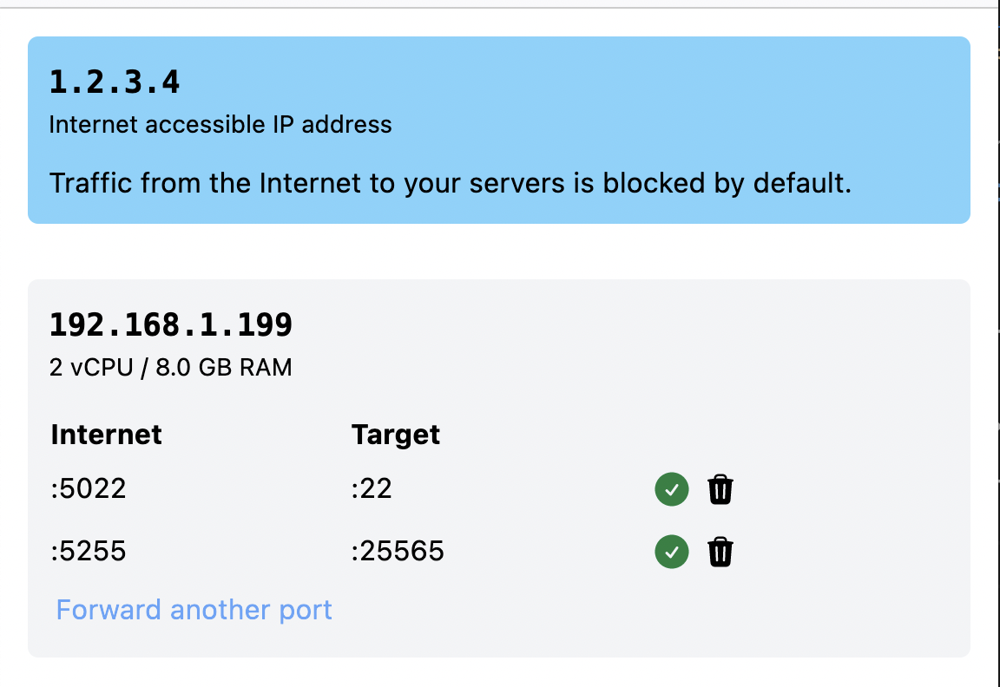

# Gated port forwarding

> [!NOTE]  
> This is a work-in-progress! 🦺🙂

Provides a way to expose a limited interface to expose ports in a network
using a Ubiquiti router running Unifi OS' Network app.

I've given out some virtual machines, running in [Proxmox VE](https://www.proxmox.com/en/proxmox-virtual-environment/overview), to friends which don't
have any way to forward traffic to them. Since publicly exposing and handing
out credentials to people didn't seem like a great idea this bridges that gap.

## TODO

- Forward a new port
  - API research ✅ (see unifi.ts)
  - Mock up ✅
- Remove an existing forward
  - API research ✅ (see unifi.ts)
  - Mock up ❓ IDK there's a button at least
- Front with authentication proxy
  - Research ✅
  - Maybe Cloudflare Access? Straightforward and maintained by someone else.

## 📸

